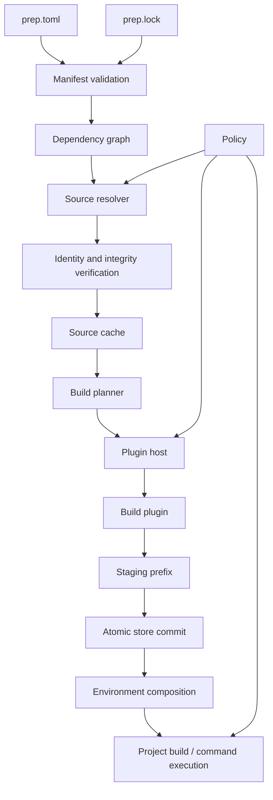
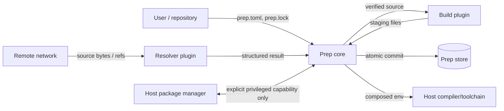

# Prep 2 architecture

Status: **proposed**

## 1. Purpose

Prep 2 is a package and build orchestration tool for native projects. It resolves dependency sources, materializes immutable inputs, invokes build capabilities, records provenance, and composes dependency environments without requiring every upstream project to adopt Prep-specific metadata.

The redesign preserves the strongest idea from the original implementation: **the core owns orchestration and state; plugins supply bounded capabilities**.

It does not preserve the original implementation's assumptions that package metadata, source locations, plugin output, archive contents, or filesystem paths are inherently trustworthy.

## 2. Goals

- Support C/C++ and other native projects without requiring a single build system.
- Resolve Git, archive, local-development, and future source types through explicit resolver capabilities.
- Support CMake, Make, Autotools, Meson, Ninja, and future build systems through plugins.
- Produce deterministic source identities and a reviewable lockfile.
- Reuse package results safely across builds where inputs are equivalent.
- Keep the core small enough to reason about and aggressively test.
- Keep plugins language-neutral.
- Make security-sensitive behavior explicit: network access, host package management, privilege, filesystem scope, and process execution.
- Provide enough evidence to answer: **what source was built, with what inputs, by which capability, and into which result?**

## 3. Non-goals for v1

- Making arbitrary untrusted build scripts safe to execute on the host. Building source is code execution; strong build sandboxing is a separate capability and future milestone.
- Solving distributed binary-cache trust in the first implementation.
- Supporting arbitrary plugin installation from the network before plugin provenance and policy are defined.
- Reproducing every command or behavior of the historical CLI.
- Providing a package registry. Prep remains able to consume upstream repositories and archives directly.
- Providing an interactive web application. The historical `prep-web` project is outside the Prep 2 core design.

## 4. System model



The architecture separates five concepts that were entangled in the original implementation:

1. **Declaration** — what the project requests.
2. **Resolution** — how a mutable or human-friendly reference becomes an immutable source identity.
3. **Execution** — how a resolver or builder is invoked.
4. **Storage** — where immutable source and build results live.
5. **Activation** — how dependency results are composed into a build or runtime environment.

## 5. Workspace structure

The initial repository should be a Rust workspace:

```text
prep/
├── crates/
│   ├── prep-cli/
│   ├── prep-core/
│   ├── prep-manifest/
│   ├── prep-protocol/
│   ├── prep-store/
│   └── prep-test-support/
├── plugins/
│   ├── git/
│   ├── archive/
│   ├── cmake/
│   ├── make/
│   └── autotools/
├── tests/
│   ├── fixtures/
│   ├── integration/
│   ├── e2e/
│   ├── security/
│   └── fuzz/
└── docs/
```

This is a logical split, not an instruction to create one crate for every abstraction. Crates should exist only where they create a real compilation, ownership, or dependency boundary.

### Proposed responsibility boundaries

`prep-cli`
: argument parsing, presentation, user prompts, exit-code mapping. No package-resolution logic.

`prep-core`
: graph planning, orchestration, policy decisions, dependency lifecycle, high-level typed errors.

`prep-manifest`
: manifest and lockfile schemas, validation, source/build declarations, compatibility parsing.

`prep-protocol`
: protocol v1 types and framing shared by the core and Rust plugin SDK. Other languages implement the same wire contract independently.

`prep-store`
: immutable source cache, build-result store, staging, transactions, path containment, leases/GC metadata.

`prep-test-support`
: synthetic plugins, temporary stores, adversarial fixtures, fault injection helpers.

## 6. Manifest model

The proposed project declaration is `prep.toml`.

A minimal example:

```toml
[package]
name = "hello"
version = "1.0.0"

[build]
systems = ["cmake", "ninja"]

[[dependencies]]
name = "fmt"
version = "11.2.0"

[dependencies.source.git]
url = "https://github.com/fmtlib/fmt"
ref = "11.2.0"
```

The manifest may contain a mutable `ref` for human convenience. It is **not** the execution identity. Resolution records an immutable commit in `prep.lock`.

Archive dependencies require an integrity value either in the manifest or, after first resolution, in the lockfile:

```toml
[dependencies.source.archive]
url = "https://example.invalid/libfoo-1.2.3.tar.gz"
sha256 = "..."
```

Local path dependencies are explicitly development inputs and must not silently become globally reusable immutable artifacts.

### Validation

Names and identifiers are semantic identifiers, not paths. At minimum, v1 package/plugin identifiers should reject:

- empty values;
- `.` and `..` path segments;
- path separators;
- control characters;
- platform-specific ambiguous path forms.

Validation happens before any filesystem or plugin operation.

## 7. Lockfile and identity

`prep.lock` is machine-managed, checked into source control, and contains the immutable resolution used for execution.

Conceptually:

```text
DeclaredSource
    │
    ▼
Resolver
    │
    ▼
ResolvedSource {
  canonical_uri,
  immutable_revision | digest,
  resolver,
  metadata
}
    │
    ▼
prep.lock
```

A lock entry should record at least:

- package identity;
- canonical source URI;
- immutable Git commit or archive digest;
- resolver identity/version;
- dependency edges required to reproduce the selected graph;
- schema version.

A lockfile update is an explicit operation. Normal builds do not silently advance mutable references.

## 8. Source lifecycle

Sources move through explicit states:

```text
requested → resolved → verified → materialized → immutable
```

A source is not eligible for build execution until verification completes.

### Git

- `ref`, branch, or tag may be used to resolve.
- the lockfile records the exact commit SHA;
- materialization verifies that checkout `HEAD` equals the locked commit;
- submodules, if supported, are independently captured as immutable identities rather than accepted as uncontrolled recursive network fetches.

### Archives

- HTTPS by default;
- digest verification occurs before extraction;
- extraction runs through a core-owned containment abstraction;
- absolute paths, `..` escape, unsafe symlink/hardlink targets, device nodes, and other policy-disallowed entries fail extraction.

## 9. Build model

A build is a function of explicit inputs:

```text
BuildInput =
  source identity
+ dependency result identities
+ build-system configuration
+ relevant environment/toolchain identity
+ Prep/build plugin protocol version
```

The first implementation does not need to promise bit-for-bit reproducibility. It should nonetheless represent inputs so cache reuse never depends only on `name + version`.

Builders write only to a fresh staging prefix. The core validates the result and atomically commits it to the store.

## 10. Store and activation

Prep 2 should not recreate the historical shared symlink overlay.

Each completed package result receives an isolated immutable prefix:

```text
~/.local/share/prep/store/
  <result-id>/
    bin/
    include/
    lib/
    share/
```

Project-local state records graph and build metadata, while source/build caches may be shared at user scope through XDG-compatible locations.

Activation composes paths from dependency prefixes:

```text
PATH             = depA/bin:depB/bin:$PATH
CMAKE_PREFIX_PATH= depA:depB:...
PKG_CONFIG_PATH  = depA/lib/pkgconfig:depB/lib/pkgconfig:...
```

No package installation may overwrite another package's files. Collisions become activation/planning decisions rather than destructive filesystem mutations.

## 11. Plugin model

Plugins are external processes implementing `protocol/v1`.

The core owns:

- process creation and termination;
- timeout and cancellation;
- sanitized environment construction;
- working-directory selection;
- protocol framing and validation;
- capability/policy decisions;
- staging directories;
- persistence and store commits;
- user prompting and secret input.

Plugins own bounded mechanisms such as:

- resolving a Git reference;
- materializing an archive;
- configuring CMake;
- invoking Make/Ninja;
- probing a host dependency.

Plugins must not own repository metadata or directly mutate Prep's store database.

See `plugin-protocol-v1.md`.

## 12. Policy and capabilities

A plugin manifest declares capabilities. Example categories:

- `network`;
- `filesystem.read.source`;
- `filesystem.write.staging`;
- `process.spawn`;
- `host.package_manager`;
- `privilege`;
- `prompt.secret`.

For v1, capability declarations provide visibility and policy gates; they are **not claimed to be a complete OS sandbox**. Where practical, the process runner should still constrain environment and filesystem roots. Strong platform sandboxing is a later layer.

Host mutation is denied by default. An `apt` or Homebrew integration must be explicitly configured and cannot be selected merely because a dependency happens to share a package name.

## 13. Error semantics

There is no numeric success/failure/error tri-state inside domain logic.

Operations return typed results, conceptually:

```rust
Result<T, PrepError>
```

Error classes include:

- invalid manifest;
- lock mismatch;
- unsupported capability;
- policy denial;
- integrity failure;
- path containment violation;
- resolution failure;
- protocol violation;
- plugin unavailable;
- plugin timeout/cancellation;
- build/test/install failure;
- store transaction failure.

CLI exit codes are a presentation concern mapped at the outer boundary.

## 14. Data-flow / trust boundaries



Trust assumptions:

- repository metadata may be malicious;
- remote sources may be malicious;
- archives may be malicious;
- plugins are executable code and require an installation/provenance policy;
- build scripts are executable code and may be malicious;
- store metadata is trusted only after successful transactional commit;
- lockfile content is reviewed project state, but still schema-validated before use.

## 15. Testing architecture

The test strategy mirrors the trust boundaries rather than source-file layout.

### Unit

- identifier and path validation;
- manifest/lock parsing;
- graph planning;
- source identity normalization;
- protocol encode/decode;
- typed error mapping.

### Property

- normalized store paths never escape configured roots;
- activation is deterministic for a fixed ordered dependency graph;
- lockfile round trips preserve semantic identity;
- failed transactions never become visible results.

### Integration

- core ↔ synthetic plugin;
- resolver → verifier → cache;
- builder → staging → store commit;
- timeout, cancellation, crash, malformed protocol, excessive output.

### End-to-end

- resolve → build → test → activate → execute;
- repeated locked build uses the same source identity;
- lock update changes identity explicitly;
- conflicting package outputs do not overwrite one another.

### Security/adversarial

- archive traversal and symlink escapes;
- malicious identifiers;
- malformed/oversized frames;
- hostile environment values;
- option-injection-like values passed through plugins;
- lock/source mismatch;
- interrupted and partial filesystem operations.

### Fuzzing

First-class fuzz targets:

- manifest parser/validator;
- lockfile parser;
- protocol frame parser;
- archive entry/path normalization;
- identifier normalization;
- graph decoding where external structured data is accepted.

## 16. Compatibility and migration

The historical C++ and Bash implementations are behavioral references, not code to transliterate.

Migration should happen in three layers:

1. characterize useful behavior with fixtures and black-box tests;
2. implement Prep 2 invariants and protocol independently;
3. port only the plugins and CLI behaviors that still fit the new model.

A one-way compatibility importer may translate historical `package.json` into `prep.toml`. Native Prep 2 behavior should not retain unsafe legacy semantics merely for compatibility.

## 17. Open design questions

These should be resolved before or during the bootstrap milestone:

1. Exact lockfile serialization: TOML versus canonical JSON. Prefer readability unless deterministic serialization materially suffers.
2. Result identity scope: source + build inputs only, or include a normalized toolchain fingerprint in v1.
3. Whether Git and archive resolvers begin as built-in Rust implementations or external reference plugins. The architecture should support both through the same internal capability interface.
4. Minimum plugin provenance model for installing third-party plugins.
5. Initial platform scope: Linux first with macOS build validation, versus Linux/macOS feature parity from milestone 1.

## 18. Acceptance criteria for the design phase

The design phase is complete when:

- Rust core and canonical-monorepo ADRs are accepted;
- protocol v1 has request/result/error/capability semantics defined;
- source identity and lockfile invariants are settled;
- store/staging/activation semantics are settled;
- threat model and security invariants are documented;
- implementation work is decomposed into issues with dependency order;
- no implementation issue requires reintroducing an implicit trust boundary from the historical code.
