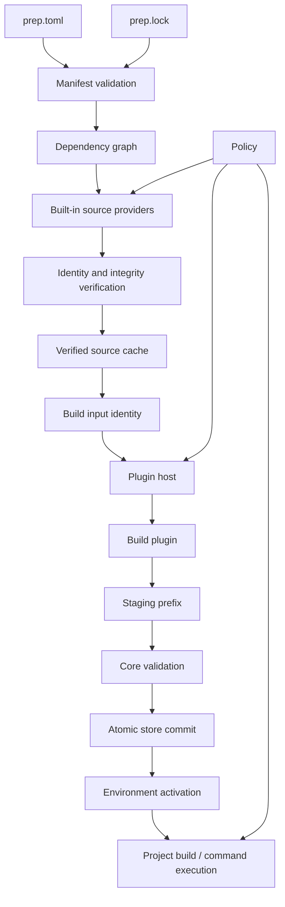
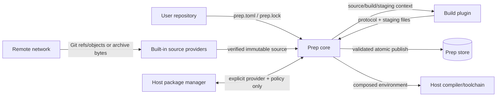

# Prep 2 architecture

Status: **proposed**

## 1. Purpose

Prep 2 is a package and build orchestration tool for native projects. It resolves dependency sources to immutable identities, materializes verified inputs, invokes build capabilities, records attributable result metadata, and composes dependency environments without requiring every upstream project to adopt Prep-specific metadata.

The redesign preserves the strongest idea from the original implementation: **a small core owns orchestration and state while language-neutral extensions provide bounded build capabilities**.

It does not preserve the original implementation's assumptions that package metadata, source locations, plugin output, archive contents, process behavior, or filesystem paths are inherently trustworthy.

## 2. Goals

- Support C/C++ and other native projects without requiring a single build system.
- Support Git, archive, and local-development sources with explicit immutable/development identity semantics.
- Support CMake, Ninja/Make, Autotools, and future build systems through language-neutral plugins.
- Produce deterministic source identities and a reviewable generated lockfile.
- Reuse package results only when material build inputs are equivalent, including target/toolchain identity.
- Keep the trusted core small enough to reason about, fuzz, and aggressively test.
- Make security-sensitive behavior explicit: network-dependent work, host package management, privilege, filesystem scope, prompts/secrets, and process execution.
- Provide enough evidence to answer: **what source was built, with what dependency/toolchain/plugin inputs, and into which result?**

## 3. Non-goals for v1

- Making arbitrary untrusted build scripts or malicious executable plugins safe to execute on the host. Building source is code execution; strong build/plugin sandboxing is a separate hardening layer.
- Solving distributed binary-cache trust in the first implementation.
- Installing or automatically updating arbitrary third-party plugins from the network.
- Supporting external source-provider plugins as part of the v1 bootstrap path.
- Reproducing every command or behavior of the historical CLI.
- Providing a package registry. Prep remains able to consume upstream repositories and archives directly.
- Providing an interactive web application. The historical `prep-web` project is outside the Prep 2 core design.

## 4. System model



The architecture separates six concepts that were entangled in the original implementation:

1. **Declaration** — what the project requests.
2. **Resolution** — how a mutable/human-friendly source reference becomes an immutable identity.
3. **Materialization** — how the exact locked source becomes a verified local source tree.
4. **Execution** — how build/host-provider plugin operations are admitted and invoked.
5. **Storage** — where immutable source/build results and transaction metadata live.
6. **Activation** — how isolated dependency results are composed into a build/runtime environment.

## 5. Repository and workspace structure

`ryjen/prep` is the canonical redesign repository while protocol and core contracts are moving (ADR 0002).

The initial implementation is a Rust workspace:

```text
prep/
├── crates/
│   ├── prep-cli/
│   ├── prep-core/
│   ├── prep-manifest/
│   ├── prep-protocol/
│   ├── prep-store/
│   └── prep-test-support/
├── plugins/
│   ├── cmake/
│   ├── ninja/
│   ├── make/
│   ├── autotools/
│   └── host/
├── tests/
│   ├── fixtures/
│   ├── integration/
│   ├── e2e/
│   ├── security/
│   └── fuzz/
└── docs/
```

This is a logical split, not an instruction to create one crate for every abstraction. Crates exist only where they create a real compilation, dependency, or test boundary.

### Proposed responsibility boundaries

`prep-cli`
: argument parsing, presentation, user prompts, exit-code mapping. No package-resolution or store logic.

`prep-core`
: graph planning, source-provider orchestration, build planning, policy decisions, dependency lifecycle, high-level typed errors.

`prep-manifest`
: manifest and lockfile schemas, validation, source/build declarations, compatibility import.

`prep-protocol`
: protocol v1 types/framing shared by the core and Rust plugin SDK. Other languages implement the same wire contract independently.

`prep-store`
: verified source cache, build-result store, staging, transactions, path containment, leases/GC metadata.

`prep-test-support`
: synthetic plugins, temporary stores, adversarial fixtures, fault injection helpers.

Git/archive source code should initially live in the smallest suitable trusted Rust boundary. Split a separate source crate only if dependencies or ownership make that a useful boundary; do not create it merely for symmetry.

## 6. Manifest model

The project declaration is `prep.toml`.

A minimal example:

```toml
[package]
name = "hello"
version = "1.0.0"

[build]
systems = ["cmake", "ninja"]

[[dependencies]]
name = "fmt"
version = "11.2.0"

[dependencies.source]
kind = "git"
url = "https://github.com/fmtlib/fmt"
ref = "11.2.0"
```

The manifest may contain a mutable `ref` for human convenience. It is **not** the execution identity. An explicit resolution/update operation records the exact commit in `prep.lock`.

Archive dependencies use a cryptographic content identity:

```toml
[dependencies.source]
kind = "archive"
url = "https://example.invalid/libfoo-1.2.3.tar.gz"
sha256 = "..."
```

The digest may be declared directly or established by an explicit lock/update workflow according to policy, but a normal locked build never consumes unverified archive bytes.

Local path dependencies are explicitly development inputs and must not silently become globally reusable immutable artifacts.

### Validation

Names and identifiers are semantic identifiers, not paths. At minimum, v1 package/plugin identifiers reject:

- empty values;
- `.` and `..` path segments;
- path separators;
- control/NUL characters;
- absolute/drive/UNC/path-prefix ambiguity on supported platforms.

Validation happens before filesystem or plugin operations. Core APIs should use validated wrapper types where they meaningfully prevent accidental bypass.

## 7. Lockfile and source identity

`prep.lock` is generated TOML (ADR 0004), checked into source control, deterministic in ordering, and contains immutable source resolution plus the selected dependency graph.

Conceptually:

```text
DeclaredSource
    │
    ▼
BuiltInSourceProvider
    │
    ▼
ResolvedSource {
  canonical_uri,
  immutable_revision | digest,
  source_kind,
  metadata
}
    │
    ▼
prep.lock
```

A lock entry records at least:

- package identity;
- canonical source URI;
- immutable Git commit or archive digest;
- source kind/schema needed to interpret that identity;
- dependency edges required to reproduce the selected graph;
- lockfile schema version.

Normal builds do not silently advance mutable references. Lockfile mutation is an explicit operation and a reviewable source-control change.

## 8. Source lifecycle

Sources move through explicit states:

```text
requested → resolved → verified → materialized → immutable local input
```

A source is not eligible for build execution until verification completes.

Git and archive begin as built-in Rust source providers under ADR 0003. External source-provider plugins are deferred.

### Git

- `ref`, branch, or tag may be used during resolution;
- the lockfile records the exact commit SHA;
- materialization verifies checkout `HEAD` equals the locked commit;
- normal locked builds do not fetch a different revision simply because a branch/tag moved;
- submodules are disabled by default unless their immutable identity policy is explicitly implemented; recursive mutable fetch is never an implicit default.

### Archives

- HTTPS by default;
- digest verification occurs before extraction;
- extraction runs through a trusted core-owned containment abstraction;
- absolute paths, `..` escape, unsafe symlink/hardlink targets, device nodes, and policy-disallowed entries fail extraction;
- expanded byte, entry-count, entry-size, and path limits bound resource use.

### Local development

A local path source is mutable development state. It is represented distinctly from locked remote content and does not claim cross-project reproducible/cache-safe identity without an explicit snapshot mechanism.

## 9. Build/result identity

A build result is reusable only when its modeled inputs are equivalent.

Conceptually:

```text
BuildInput =
  immutable source identity
+ ordered dependency result identities
+ target platform/triple
+ normalized toolchain identity
+ build-system/plugin content identity
+ build-system configuration/options
+ explicitly modeled relevant environment
+ Prep/source-normalization/protocol schema versions where they affect output
```

The first implementation does not promise bit-for-bit reproducibility or complete hermeticity. It **does** prefer a cache miss to unsafe reuse across materially different compilers, targets, dependencies, or build configurations.

A v1 toolchain fingerprint includes enough compiler/target identity to distinguish obvious ABI/code-generation differences. It can evolve without claiming a universal cross-machine toolchain hash.

Builders write intended install outputs only to a fresh staging prefix. The core validates the result and atomically commits it to the store.

## 10. Store and activation

Prep 2 does not recreate the historical shared symlink overlay.

Each completed package result receives an isolated immutable prefix:

```text
~/.local/share/prep/store/
  <result-id>/
    bin/
    include/
    lib/
    share/
```

Project-local state records graph/build metadata, while verified source/build caches may be shared at user scope through XDG-compatible locations.

Publication is transactional:

```text
create staging → execute → validate → atomic publish → record metadata
```

Failed/interrupted staging never becomes a valid cached result.

Activation composes paths from dependency prefixes rather than overlaying files:

```text
PATH              = depA/bin:depB/bin:$PATH
CMAKE_PREFIX_PATH = depA:depB:...
PKG_CONFIG_PATH   = depA/lib/pkgconfig:depB/lib/pkgconfig:...
```

No package installation overwrites another package's files. Collisions become activation/planning diagnostics or explicit policy decisions.

## 11. Plugin model

Build and host-provider plugins are external processes implementing `prep.plugin/1`.

The core owns:

- plugin discovery/content identity for official/local v1 plugins;
- process creation and termination;
- timeout, cancellation, and process-tree cleanup strategy;
- sanitized environment construction;
- working/source/build/staging root selection;
- protocol framing and validation;
- admission-policy decisions;
- persistence/store publication;
- user prompting and secret handling.

Plugins own bounded mechanisms such as:

- configuring CMake;
- invoking Ninja/Make;
- running tests;
- installing into staging;
- probing a host dependency;
- proposing/applying an explicitly authorized host-package change.

Plugins do not own Prep repository metadata or directly publish Prep store state.

Reference/conforming plugins are required to use assigned roots, but capability declarations are not an OS sandbox. Without platform containment, malicious executable code may attempt actions available to the invoking user. Prep v1 therefore makes strong claims about what it authorizes and what enters Prep-owned state, not about containing arbitrary hostile code.

See `plugin-protocol-v1.md` and ADR 0005.

## 12. Policy and capabilities

A plugin manifest declares capabilities such as:

- `network`;
- `filesystem.read.source`;
- `filesystem.write.staging`;
- `process.spawn`;
- `host.package_manager`;
- `privilege`;
- `prompt` / `prompt.secret`.

Capabilities provide visibility, admission policy, and attribution. Prep refuses to authorize an operation whose required capability is undeclared or denied.

They are **not claimed to be complete OS containment**. Hardened platform runners may later enforce the same policy through namespaces/seccomp/sandbox mechanisms or platform equivalents.

Host mutation is denied by default. An apt/Homebrew provider must be explicitly configured/authorized and cannot be selected merely because a dependency shares a package name.

Offline mode prevents built-in source providers and Prep-authorized plugin operations from using network-dependent paths. Strong proof that a malicious plugin cannot access the network requires platform isolation and is not falsely implied by policy alone.

## 13. Plugin distribution/provenance

Protocol v1 does not install arbitrary plugin code from URLs/registries (ADR 0005).

Allowed v1 sources are:

- official/reference plugins distributed with Prep; or
- explicitly installed/configured local plugin content.

Plugin execution identity includes enough content/manifest digest information to distinguish changed code even if the plugin's declared semantic version is unchanged.

Remote plugin installation/update requires a later design covering provenance/signatures, trust roots, namespace ownership, rollback, and capability review.

## 14. Error semantics

There is no numeric success/failure/error tri-state inside domain logic.

Operations return typed results, conceptually:

```rust
Result<T, PrepError>
```

Error classes include:

- invalid manifest;
- lock mismatch;
- unsupported operation/capability;
- policy denial;
- integrity failure;
- path containment violation;
- source resolution/materialization failure;
- protocol violation;
- plugin unavailable;
- plugin timeout/cancellation/process failure;
- build/test/install failure;
- store transaction failure.

CLI exit codes are a presentation concern mapped at the outer boundary.

## 15. Data-flow and trust boundaries



Trust assumptions:

- repository metadata may be malicious;
- remote sources/archives may be malicious;
- plugin protocol input/output is untrusted structured data;
- installed plugin executables and build scripts are executable code, not made safe merely by protocol validation;
- store metadata/results are trusted only after validated transactional commit;
- lockfile is reviewed project state but still schema-validated before use.

## 16. Testing architecture

The test strategy mirrors trust boundaries rather than source-file layout.

### Unit

- identifier/path validation;
- manifest/lock parsing;
- graph planning;
- source identity normalization;
- build/toolchain/result identity;
- protocol encode/decode;
- typed error mapping.

### Property

- normalized Prep-owned paths never escape configured roots;
- activation is deterministic for a fixed ordered graph;
- lockfile round trips preserve semantic identity;
- failed transactions never become visible results;
- modeled compiler/target/dependency/config changes alter result identity.

### Integration

- built-in resolver → verifier → cache;
- core ↔ synthetic external build plugin;
- builder → staging → store commit;
- timeout, cancellation, spawned-child cleanup, crash, malformed protocol, excessive output.

### End-to-end

- resolve → lock → materialize → build → test → publish → activate → execute;
- repeated locked build uses the same source identity;
- explicit lock update changes identity;
- offline verified-cache build;
- conflicting package outputs do not overwrite one another.

### Security/adversarial

- archive traversal, symlink/hardlink escape, special-file and expansion-limit cases;
- malicious identifiers/path prefixes;
- malformed/oversized frames;
- hostile environment/argv values;
- lock/source mismatch;
- interrupted/partial filesystem transactions;
- admission-policy tests clearly separated from optional OS-sandbox enforcement tests.

### Fuzzing

First-class fuzz targets:

- manifest parser/validator;
- lockfile parser/validator;
- protocol frame/state parser;
- archive entry/path normalization;
- identifier/path normalization;
- graph decoding where external structured data is accepted.

## 17. Compatibility and migration

The historical C++ and Bash implementations are behavioral references, not code to transliterate.

Migration happens in three layers:

1. characterize useful behavior with fixtures/black-box tests;
2. implement Prep 2 invariants/contracts independently;
3. port only CLI/build-plugin behavior that still fits the new model.

A one-way compatibility importer may translate historical `package.json` into `prep.toml`. Native Prep 2 behavior does not retain unsafe legacy semantics merely for compatibility.

The historical `cli`/`web` submodules stay only during the design/bootstrap transition and leave the active build graph once Prep 2 is self-contained.

## 18. Design decisions and remaining questions

Proposed decisions are recorded as ADRs:

- ADR 0001 — Rust 2024 core/CLI;
- ADR 0002 — canonical monorepo during protocol stabilization;
- ADR 0003 — built-in Git/archive source providers first;
- ADR 0004 — generated TOML lockfile + toolchain-aware build identity;
- ADR 0005 — explicit local/content-identified plugins; remote installation deferred.

Remaining bootstrap questions are narrower implementation details rather than trust-model choices:

1. Exact normalized fields and versioning rules for the v1 toolchain fingerprint.
2. Exact lockfile table layout/stable ordering rules.
3. Linux/macOS parity boundary for host-specific providers; the core quality floor still compiles/tests both while Linux is the primary implementation environment.
4. Which platform sandbox mechanism, if any, is practical enough for an optional hardened runner without blocking v1.

## 19. Acceptance criteria for the design phase

The design phase is complete when:

- ADRs 0001-0005 are accepted or explicitly revised;
- protocol v1 request/result/error/event semantics are accepted;
- source identity and lockfile invariants are settled;
- build/result identity includes target/toolchain/dependency/plugin inputs at the agreed v1 granularity;
- store/staging/activation semantics are accepted;
- threat model/security claim boundary is explicit;
- implementation work is decomposed into issues with dependency order;
- no implementation issue requires reintroducing an implicit trust boundary from the historical code.
